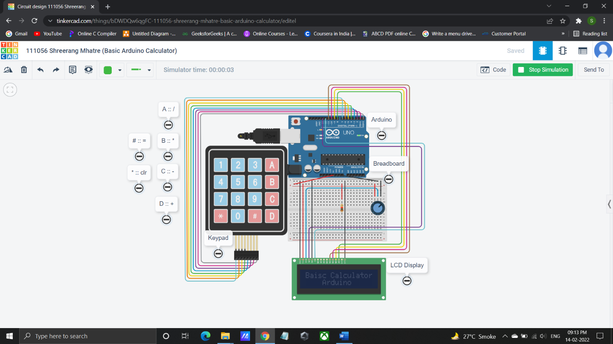

# Basic Arduino Calculator

This project demonstrates the creation of a basic calculator using an Arduino UNO R3 microcontroller, a 4x4 keypad for user input, and a 16x2 LCD display to show the results. The calculator performs four fundamental arithmetic operations: addition, subtraction, multiplication, and division. It allows users to input numbers and operators in real-time and provides immediate feedback on the LCD screen.


## Table of Contents

- Installation
- Project Link
- Project Components
- Features
- Getting Started
- Schematic
- Usage
- Contributing
- Acknowledgements
- License
## Installation

```bash
  -Go to my project link below
  -Tinker/Copy it on your account
  -Run Locally by starting Simulation
```
    
## Poject Link

https://www.tinkercad.com/things/bDWDQw6qgFC?sharecode=TPcmGf7me-Xx_1ggIeV19zSjpX3zv6fZzCNzT3PgOz4 
## Project Components

- Arduino UNO R3
- 4x4 Keypad
- 16x2 LCD Display
- Arduino IDE for code development (for physical implementation)
- Tinkercad Software for simulation


## Features

- Supports addition, subtraction, multiplication, and division.
- Real-time user input via a 4x4 keypad.
- Immediate feedback displayed on a 16x2 LCD screen.
- Capable of handling integer and floating-point calculations.
- 'C' key for clearing and resetting calculations.
- Continuous calculation support without system reset.


## Getting Started

For Actual Implementation

    1. Clone this repository to your local machine.

    2. Open the `calculator.ino` file using the Arduino IDE.

    3. Upload the code to your Arduino UNO R3.

    4. Wire up the hardware components as per the provided schematic.

    5. Power on your Arduino and interact with the calculator using the keypad and observe the results on the LCD display.
## Schematic


## Usage

```bash
- Press numeric keys ('0' to '9') to input numbers.
- Use operator keys ('+', '-', '*', '/') for basic arithmetic operations.
- 'C' key clears the display and resets the calculator.
- '=' key computes and displays the final result.
```


## Contributing

Contributions are always welcome!

See `contributing.md` for ways to get started.

Please adhere to this project's `code of conduct`.

Anyone can contribute to the project by simply tinkering the project to your local machine and adding new features and functionalities and and making it more useful.

## Acknowledgements

 - [Arduino](https://learn.sparkfun.com/tutorials/what-is-an-arduino/all)
 - [DIY Calculator](https://www.learnelectronicsindia.com/post/arduino-diy-calculator-using-a-4-4-keypad-and-16-2-lcd-display)


## License

[MIT](https://choosealicense.com/licenses/mit/)

